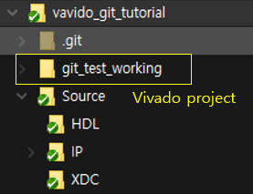
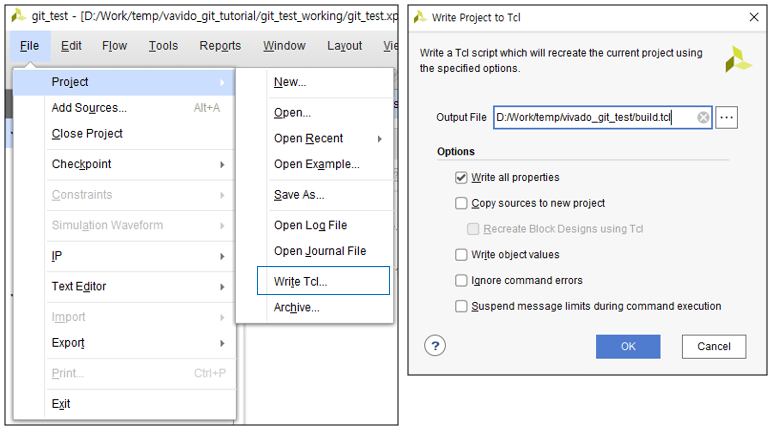
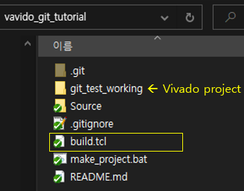

# Vivado project Git으로 관리하는 방법  

Vivado project 폴더를 git으로 관리하려고 하면 vivado 프로그램 자체에서 생성하는 파일들이 매우 많을 뿐만아니라 상황에 따라서 50MB, 100MB이상의 파일이 생성되기 때문에 프로젝트 폴더의 모든 파일을 git으로 관리하는것은 매우 비효율적입니다.

아래와 같은 방법을 사용하여 vivado project를 git으로 관리 할 수 있습니다. 


`HDL source 파일 및 vivado의 IP 파일을 vivado project 폴더와 구분하여 별도의 폴더로 관리합니다.`  


  

위와 같이 git으로 관리되는 폴더 아래에 vivado에서 생성하는 파일들을 모아놓은 project 폴더와 실제 소스를 구별하여 정리하면 쉽게 관리할 수 있습니다.  

`vivado 작업 후 commit 하고자 하면 vivado에서 아래와 같이 vivado project를 자동으로 생성하도록 해주는 TCL 파일을 만들어줍니다.`

  

HDL 파일이나 IP 파일은 별도의 폴더에서 관리하므로 "copy source to new project"에 채크할 필요는 없습니다. 생성되는 tcl 파일은 git으로 관리하려고 하는 project 폴더의 상위 위치에 저장합니다.  
저는 "build.tcl"로 저장했습니다.  

  

`현재 작업중인 project 폴더는 git으로 관리 할 것이 아니기 때문에 .gitignore 파일에 해당 폴더를 등록합니다.`  

```    
git_test_working/
```

`git clone 후에 자동으로 project를 만들기 위해 위에서 저장한 build.tcl 파일을 실행해 주어야 하며 이를 편하게 하기 위하여 아래와 같이 "make_project.bat"라는 파일을 만들어줍니다.`

```console
d:\Xilinx\Vivado\2022.1\bin\vivado.bat -mode tcl -source build.tcl
pause
```  

이제 commit 합니다.  
위의 예제는 아래에서 확인 할 수 있습니다.  

[vavido_git_tutorial](https://github.com/jeongcho/vavido_git_tutorial)  

이제 해당 project를 clone 한 후 "make_project.bat" 파일을 실행하면 "build.tcl"을 생성했던 시점의 vivado project 폴더가 자동으로 생성됩니다.